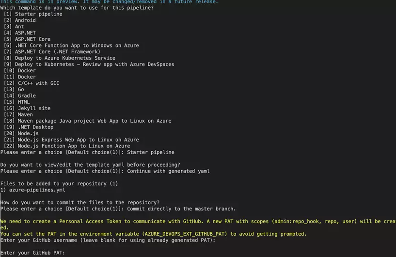

# Read Me

[](https://github.com/Huisman-Equipment/hsle-azure-pipelines/blob/master/LICENSE.md) [](http://www.repostatus.org/#active)

***Created for HUISMAN EQUIPMENT B.V., Schiedam, the Netherlands***

This repository contains a fully-functioning demo pipeline that will deploy new ARM templates to Azure.

## What you will learn
In this tutorial, you're going to learn how to build a real Azure DevOps release pipeline that automates infrastructure. It will:
- Build a temporary Azure resource group.
- Provision an Azure VM via an ARM template.
- Set up said ARM template in a CI/CD pipeline.
- Upon any change to the template, kick off a template validation test.
- Deploy the ARM template to Azure.
- Test the deployed infrastructure.
- Tear down all Azure resources.

## Prerequisites
* An **Azure DevOps organization** - Check out the '[Microsoft QuickStart](https://docs.microsoft.com/en-us/azure/devops/organizations/accounts/create-organization?view=azure-devops#create-an-organization)' guide for instructions on how to do this. In this tutorial, you'll be working with a project called ServerAutomationDemo.
* A **GitHub repo** - You'll be working from a new GitHub repo using this template as guidance.
* A **GitHub personal access token** - [Create the token](https://help.github.com/en/github/authenticating-to-github/creating-a-personal-access-token-for-the-command-line#creating-a-token) with the permissions of admin:repo_hook, all repo and all user options.

* Cloud Shell or PowerShell 6+ if running locally.
* [Azure CLI](https://docs.microsoft.com/en-us/cli/azure/install-azure-cli?view=azure-cli-latest) is installed (if running locally) - The same can also be performed via the Azure Portal or in PowerShell.
* Have the following items handy:
  - The name of the Azure subscription resources will be deployed to.
  - The ID of the subscription.
  - The Azure AD tenant ID.
  - The DevOps organization name.
  - The region you're placing resources into - the examples will use eastus.
  - The name of the Azure resource group to put the temporary key vault into. I use "ServerAutomationDemo".
  - A password to assign to the local administrator account on a deployed VM - examples will use "I like AWS".
  - The URL to the GitHub repo, this repo.

## Preparing Azure Resources

### Logging in with the Azure CLI
Open a PowerShell 6+ console and authenticate to Azure using the command az login. This creates a browser window which will prompt you for your account.
Once you are authenticated, be sure to set your subscription to the default. Setting it as the default will prevent you from having to specify it constantly.
```
az login
az account set --subscription 'YOURSUBSCRIPTION'
```
### Installing the Azure CLI DevOps Extension
To manage Azure DevOps from the Azure CLI, you'll need to install the DevOps extension.

`az extension add --name azure-devops`

Once the extension has been installed, set your organization as the default to prevent specifying it over and over.

`az devops configure --defaults organization=https://dev.azure.com/'YOURORGANIZATION'`

### Creating the Resource Group
Although this pipeline will create a temporary resource group, you should create one for any resources in this demo. More specifically, this resource group is where you'll create an Azure Key Vault.

`az group create --location "eastus" --name "ServerAutomationDemo"`

### Creating the Azure Service Principal
You are going to need an Azure service principal to a) authenticate to the Azure Key Vault, and b) use it to authenticate a [service connection](https://docs.microsoft.com/en-us/azure/devops/pipelines/library/service-endpoints?view=azure-devops). Create the service principal for both the key vault and for the eventual ARM deployment.

```
$spIdUri = "http://ServerAutomationDemo"
$sp = az ad sp create-for-rbac --name $spIdUri | ConvertFrom-Json
```

At this point, save the value of $sp.appId somewhere. When you get to building the pipeline later, you will need this!

### Building the Key Vault
This pipeline needs to reference passwords. Rather than it storing passwords in clear text, all your sensitive information will be stored in an Azure Key Vault.

To create the key vault, use the az command as shown below. It creates the key vault in the previously created resource group. Also notice the enabled-for-template-deployment which changes the key vault access policy to allow the future ARM deployment to access the key vault.

```
az keyvault create --location $region --name "ServerAutomationDemo-KV" --resource-group "ServerAutomationDemo" --enabled-for-template-deployment true
```

### Creating Key Vault Secrets
Once the key vault is created, it's time to create the secrets. For this demo, create two called ServerAutomationDemo-AppPw and StandardVmAdminPassword. The AppPw password is the password for the service principal. The VmAdmin password will be assigned to the local administrator account on the VM deployed.

```
az keyvault secret set --name "ServerAutomationDemo-AppPw" --value $sp.password --vault-name "ServerAutomationDemo-KV"
az keyvault secret set --name StandardVmAdminPassword --value "I like azure." --vault-name "ServerAutomationDemo-KV"`
```

**NOTE:** here you're providing the service principal password ($sp.password) obtained earlier.

### Allowing the Pipeline to Access the Key Vault
Next up, the pipeline needs permission to access the key vault. Relax the key vault's access policy a bit and provide the service principal created with get and list permissions to manage key vault secrets.

`az keyvault set-policy --name "ServerAutomationDemo-KV" --spn $spIdUri --secret-permissions get list`

## Preparation in Azure DevOps

### Installing the Pester Extension
First action to perform is installing the PesterRunner Azure DevOps extension. This pipeline is going to run two sets of [Pester](https://pester.dev/) tests to ensure the VM ARM deployment was successful. One of the easiest ways to run Pester tests is using the PesterRunner extension.

`az devops extension install --extension-id PesterRunner --publisher-id Pester`

### Creating the Azure DevOps Project
Run the commands below to create the project and to set the project as your default.

```
az devops project create --name "ServerAutomationDemo"
az devops configure --defaults project=ServerAutomationDemo
```

### Creating the Service Connections
Your pipeline needs to authenticate to two services - ARM and your GitHub repo. To do this, the 2 service connections must be created.

First, create the ARM service endpoint. The command below will prompt for the service principal password. Be sure to first display it on the console and copy it to your clipboard.
Then fill in your subscription ID, tenant ID and replace the subscription name below.

```
## Run $sp.password and copy it to the clipboard
$sp.Password

## create the service endpoint
az devops service-endpoint azurerm create --azure-rm-service-principal-id $sp.appId --azure-rm-subscription-id "YOURSUBSCRIPTIONIDHERE" --azure-rm-subscription-name 'YOURSUBSCRIPTION' --azure-rm-tenant-id $tenantId --name 'ARM'
```

Next, create a service connection for GitHub. Since the pipeline will be triggered via Git commit, it will need to be able to read the repo.

At this point that GitHub personal access token comes in handy. Below you'll also need to paste in the service principal password again. You're using the same service principal for both service connections.

```
$gitHubServiceEndpoint = az devops service-endpoint github create --github-url '<https://github.com/COMPANYNAME/ServerAutomationDemo>' --name 'GitHub' | ConvertFrom-Json
## paste in the GitHub token when prompted
```

### Creating the Variable Group
The pipeline will reference key vault secrets for two passwords. To securely do this create a new [variable group](https://docs.microsoft.com/en-us/azure/devops/pipelines/library/variable-groups?view=azure-devops&tabs=yaml) and link it to the key vault.

Create the variable group as shown below:

`az pipelines variable-group create --name "ServerAutomationDemo" --authorize true --variables foo=bar`

**NOTE:** notice the foo=bar variable? This isn't used but a single variable is required to create the variable group.

### Linking the Variable Group to a Key Vault
At this point, you'll have to go to the Azure DevOps portal. Navigate to the Azure DevOps project and click on Library. You then see the ServerAutomationDemo variable group. Click on the ServerAutomationDemo variable group.

In the variable group, click on **Link secrets from an Azure key vault as variables**. Once you do, you will then be warned about erasing all variables. Click **Confirm**. This action is fine since the foo variable was temporary.

Once confirmed, select both the **ARM service connection** AND the **ServerAutomationDemo-KV** key vault you created earlier. Click **Add**.

Check both of the secrets created earlier and click **OK** and **Save** to save the changes.

## Project Files Overview

In our GitHub repo for this tutorial, you'll find a few files.
- _azure-pipelines.yml_ - The final YAML pipeline.
- _connect-azure.ps1_ - PowerShell script to authenticate to an Azure subscription.
- _server.infrastructure.tests.ps1_ - A simple Pester test to confirm VM configuration is good.
- _server.json_ - An Azure ARM template to provision a VM.
- _server.parameters.json_ - Azure ARM parameters template that provides the ARM template with parameter values.
- _server.templates.tests.ps1_ - Pester "unit" tests to confirm the ARM template is valid.

**NOTE:** be sure to replace your subscription ID and key vault name for the key vault in the _'server.parameters.json'_ file.

## Creating the Pipeline
Run the below command which then creates a pipeline called ServerAutomationDemo using the provided GitHub repo as a trigger, look at the master branch, and use the service connection built earlier.

```
az pipelines create --name "ServerAutomationDemo" --repository "https://github.com/COMPANYNAME/ServerAutomationDemo" --branch master --service-connection $gitHubServiceEndpoint.id --skip-run
```

Depending on if you have the _'azure-pipelines.yml'_ file in your GitHub repo, you may or may not receive feedback like below. Either way, your console will look similar. Be sure to have your GitHub personal access token ready!



## YAML Pipeline Review

At this point, the pipeline is ready to run. The _'azure-pipelines.yml'_ file is the pipeline when using the multi-stage YAML pipeline feature.

Let's break down the various components that make up this YAML pipeline.

### The Trigger
Since you're building a CI pipeline that automatically runs, you will also need a trigger. The trigger below instructs the pipeline to run when a commit is detected in the Git master branch.

Notice the paths section. By default, if you don't specifically include or exclude files or directories in your CI build, the pipeline will run when a commit is done on any file. Because the project is built around your ARM template, you don't want to run the pipeline if, for example, you made a tweak to a Pester test.

```
- trigger:
  - branches:
    - include:
      - master
  - paths:
    - include:
      - server.json
      - server.parameters.json
```

### The Pool
Every build needs an agent. Every build agent needs to run on a VM. In this case, the VM is using the ubuntu-latest VM image.

```
- pool:
  - vmImage: "ubuntu-latest"
```

### Variables
Next, we have all variables and the variable group. Various tasks in this pipeline require it reading values like the Azure subscription ID, tenant ID and the application ID for the service principal and so on. Rather than replicating those static values in each task, they are defined as variable.
Also inspect the group element which references to the variable group you created earlier. Be sure to replace the subscription_id and tenant_id at this time.

Remember that in the **Creating the Azure Service Principal** section you were reminded to save the value of $sp.appId? This is where you'll need it. Assign the value of that service principal application ID to application_id as shown below.

```
variables:
  - group: ServerAutomationDemo
  - name: azure_resource_group_name
    value: "ServerProvisionTesting-$(Build.BuildId)"
  - name: subscription_id
    value: "XXXXXXXXXXXXX"
  - name: application_id
    value: "XXXXXXXXXXXXX"
  - name: tenant_id
    value: "XXXXXXXXXXXX"
```

**NOTE:** verify the value of the azure_resource_group_name variable. Inside of that value you'll see $(Build.BuildId). This is a system variable that represents the build ID of the current job. In this context, it's used to ensure your temporary resource group created is unique.

### PowerShell Prep Tasks
The next tasks invoke some PowerShell code. The pipeline example uses PowerShell to create and remove a temporary resource group for testing purposes. In these deployment tasks, you'll see two examples of invoking PowerShell code.

The first invokes _'connect-azure.ps1'_ in our repository. It authenticates to the Azure subscription for subsequent Azure PowerShell commands to run. Actually, the Azure PowerShell connect task is calling the script, and passing a key vault secret value (ServerAutomationDemo-AppPw) + pipeline variables subscription_id, application_id and tenant_id.

The second task is running PowerShell code inline, meaning a script doesn't already exist. Instead, the PowerShell code is defined in the pipeline YAML itself using the value of the azure_resource_group_name pipeline variable.

```
- task: PowerShell@2
  inputs:
    filePath: "connect-azure.ps1"
    arguments: '-ServicePrincipalPassword "$(ServerAutomationDemo-AppPw)" -SubscriptionId $(subscription_id) -ApplicationId $(application_id) -TenantId $(tenant_id)'
- task: PowerShell@2
  inputs:
    targetType: "inline"
    script: New-AzResourceGroup -Name $(azure_resource_group_name) -Location eastus -Force
```

### Pester Template Test
Next we have the first Pester test. In a CI/CD pipeline such as this, it's important to have a few different layers of tests. If you were creating a pipeline for a software project, you may create various unit tests.

Since this example pipeline is all built around a single ARM VM deployment, the first "unit" tests will test the validity of the JSON template. Inside the _'server.templates.tests.ps1'_ file you can add as many different tests on the ARM template file itself as you'd like.

Notice below, the pipeline is using various system variables. These variables are referencing the file location of the files once they get onto the build agent.

The PesterRunner task is sending the test results out to an XML file which will then be read later in the pipeline.

```
- task: Pester@0
  inputs:
    scriptFolder: "@{Path='$(System.DefaultWorkingDirectory)/server.template.tests.ps1'; Parameters=@{ResourceGroupName='$(azure_resource_group_name)'}}"
    resultsFile: "$(System.DefaultWorkingDirectory)/server.template.tests.XML"
    usePSCore: true
    run32Bit: False
```

### The ARM VM Deployment
We have come to the ARM deployment. Since the entire pipeline is build around the ability to deploy a VM, this one is important! This task deploys the ARM template providing all of the required attributes needed to make it happen.

**NOTE:** see the deploymentOutputs: arm_output attribute. In the next step, a task needs to connect to the VM that was deployed. The deploymentOutputs option creates a pipeline variable that can be referenced in other tasks. **You could for example return the IP or DNS of the VM**.

```
- task: AzureResourceManagerTemplateDeployment@3
    inputs:
      deploymentScope: "Resource Group"
      azureResourceManagerConnection: "ARM"
      subscriptionId: "1427e7fb-a488-4ec5-be44-30ac10ca2e95"
      action: "Create Or Update Resource Group"
      resourceGroupName: $(azure_resource_group_name)
      location: "East US"
      templateLocation: "Linked artifact"
      csmFile: "server.json"
      csmParametersFile: "server.parameters.json"
      deploymentMode: "Incremental"
      deploymentOutputs: "arm_output"
```

### Pester Acceptance Test
Once the VM is deployed, you need to ensure it was deployed properly with an "integration" and or "acceptance" test. This PesterRunner task invokes another set of infrastructure-related tests to ensure the VM was deployed successfully.

You can see that we're passing in the value of the output of the ARM deployment via the ArmDeploymentJsonOutput parameter. The Pester test script file has a parameter defined that takes the value and reads the DNS hostname of the VM.

```
- task: Pester@0
    inputs:
      scriptFolder: "@{Path='$(System.DefaultWorkingDirectory)/server.infrastructure.tests.ps1'; Parameters=@{ArmDeploymentJsonOutput='$(arm_output)'}}"
      resultsFile: "$(System.DefaultWorkingDirectory)/server.infrastructure.tests.XML"
      usePSCore: true
      run32Bit: False
```

Below you see what the _'server.infrastructure.tests.ps1'_ PowerShell script looks like. It will read the VM's DNS hostname to then run a simple open port check.

```
$ArmDeploymentOutput = $ArmDeploymentJsonOutput | convertfrom-json

## Run the tests
describe 'Network Connectivity' {
    it 'the VM has RDP/3389 open' {
        Test-Connection -TCPPort 3389 -TargetName $ArmDeploymentOutput.hostname.value -Quiet | should -Be $true
    }
}
```

The only reason the pipeline deployed any infrastructure was to test the new ARM template. Because this is temporary, it needs to be cleaned up.

In the last PowerShell task, the pipeline removes the resource group, and everything in it.

```
- task: PowerShell@2
  inputs:
    targetType: "inline"
    script: Get-AzResourceGroup -Name $(azure_resource_group_name) | Remove-AzResourceGroup -Force
```

### Pester Test Publishing
Finally, we have come to the last set tasks. Azure Pipelines has a task called Publish Test Results. This task reads an XML file on the build agent and displays test results in Azure DevOps. This is a handy way to see the results of all tests run.

```
- task: PublishTestResults@2
  inputs:
    testResultsFormat: "NUnit"
    testResultsFiles: "$(System.DefaultWorkingDirectory)/server.infrastructure.tests.XML"
    failTaskOnFailedTests: true

- task: PublishTestResults@2
  inputs:
    testResultsFormat: "NUnit"
    testResultsFiles: "$(System.DefaultWorkingDirectory)/server.template.tests.XML"
    failTaskOnFailedTests: true
```


## Using the Azure DevOps Pipeline

We're ready to run the pipeline. In the Azure DevOps web UI, ensure you are in the ServerAutomationDemo project. Once there, click on Pipelines and you should see the ServerAutomationDemo pipeline.
One way to run the pipeline is to click on the three dots on the far right as shown below. Then, click on Run pipeline. This will kick off the automation.


The pipeline will run each task as instructed. By the end, you should see all green check marks for each task performed by the job as shown below.


## Cleaning Up

Once you're done with the pipeline, you should clean things up. After all, this is a tutorial and not a production task!

Below, you will find some commands to clean up everything built in this README file. This code removes your service principal, Azure AD application, the resource group and everything in it, and the Azure DevOps project.

```
$spId = ((az ad sp list --all | ConvertFrom-Json) | ? { '<https://ServerAutomationDemo>' -in $_.serviceprincipalnames }).objectId
az ad sp delete --id $spId

## Remove the resource group
az group delete --name "ServerAutomationDemo" --yes --no-wait

## Remove project
$projectId = ((az devops project list | convertfrom-json).value | where { $_.name -eq 'ServerAutomationDemo' }).id
az devops project delete --id $projectId --yes
```

## Summary

This tutorial is meant to give you a sneak peak into building a real Azure DevOps infrastructure automation pipeline. Even though there are countless other ways to build a pipeline, the skills you've now learned should assist you through different configurations.

**NOTE:** when you are not able to clone repos and/or upload files using [git](https://git-scm.com/) or the [GitHub Desktop client](https://desktop.github.com/), run:
* git config --global http.sslBackend openssl
* git config --global http.sslVerify false

In the [demo.ps1](https://github.com/lgeurts/azure-devops-pipeline/blob/master/demo.ps1) PowerShell script you will find all commands mentioned in this tutorial.

                        <kbd>[WARNING]: THIS TEMPLATE IS ONLY AVAILABLE ON APPROVAL BY YOUR MANAGER!</kbd>

## Authors

The initial setup and this file were created by [Luc Geurts](https://lgeurts.github.io). Thx to [Paulo Schwab Rocha](https://github.com/pschwab1) for his excellent contributions.

<3

***
*Tested on Windows 10 1809 and Ubuntu 18.04 LTS*
